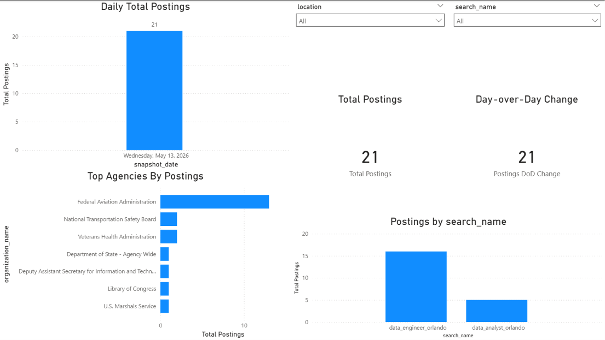

# USAJOBS Job Market Analytics Pipeline (Airflow + dbt + Postgres + Power BI)

This project implements an end-to-end data engineering pipeline that ingests job posting data from the **USAJOBS Search API**, stores raw API responses in **PostgreSQL (JSONB)**, transforms semi-structured JSON into analytics-ready tables with **dbt**, orchestrates runs with **Apache Airflow**, and visualizes results in **Power BI**.

The pipeline is designed with a clear **raw → staging → marts** separation and supports config-driven ingestion via YAML search definitions.

---

## 🚀 Project Overview

### Goal
Build a production-style ELT pipeline for tracking job market trends using USAJOBS postings (e.g., postings volume over time, top hiring agencies, trends by keyword and location).

### Key Questions Answered
- How many job postings appear daily for a given search (keyword + location)?
- Which agencies/organizations are posting the most jobs for a given search?
- How do posting volumes change day-over-day?
- How do results vary across multiple search definitions (keyword/location combinations)?

---

## 🏗️ Architecture

```text
USAJOBS Search API
   └── Config-driven queries (config/searches.yml)
            |
            v
Raw Layer (Postgres JSONB)
   └── raw.usajobs_search_results (one row per search + page)
            |
            v
dbt Transformations (staging → marts)
   ├── analytics.stg_usajobs_search_results
   ├── analytics.stg_usajobs_postings (explode SearchResultItems)
   └── analytics.mart_job_postings_daily (reporting mart)
            |
            v
Power BI Dashboard
   └── KPIs + trends + slicers (search_name, location, date)
```
---

## 🧰 Tech Stack Used

 - **Ingestion:** Python (requests), USAJOBS Search API, YAML-driven configuration (`config/searches.yml`)  
 - **Orchestration:** Apache Airflow (Docker) — DAG chaining `ingest_usajobs → dbt_run → dbt_test`  
 - **Storage:** PostgreSQL (raw JSONB + analytics schema)  
 - **Transformations / Modeling:** dbt (sources/refs, staging → marts, tests)  
 - **Analytics / BI:** Power BI (dashboards, slicers/filters, basic DAX measures)  
 - **Dev Tools:** Git/GitHub, Docker Desktop, VS Code

---

## 📁 Repo structure
```text
.
├── config/
│   └── searches.yml
├── dags/
│   └── usajobs_ingestion_dag.py
├── ingestion/
│   ├── usajobs_ingest.py
│   └── (other helper scripts)
├── dbt/
│   ├── profiles.yml
│   └── usajobs_analytics/
│       ├── dbt_project.yml
│       └── models/
│           ├── staging/
│           │   ├── sources.yml
│           │   ├── stg_usajobs_search_results.sql
│           │   ├── stg_usajobs_postings.sql
│           │   └── stg_usajobs_postings.yml
│           └── marts/
│               ├── mart_job_postings_daily.sql
│               └── mart_job_postings_daily.yml
├── powerbi/
│   └── screenshots/
│       ├── usajobs_postings_dashboard.png
│       └── usajobs_postings_analytics_dashboard.pdf
└── docker-compose.yml
```

---

## 🧱 Data Model / Outputs

### Raw (Postgres schema: `raw`)
- `raw.usajobs_search_results`  
  Stores the full USAJOBS Search API response per **search + page** as `response_json` (JSONB), along with ingestion metadata (e.g., `run_id`, `ingested_at`, `search_name`, `keyword`, `location`, `page_number`). This raw layer is kept intact for traceability and reprocessing.

### Staging (dbt schema: `analytics`)
- `analytics.stg_usajobs_search_results`  
  Clean access layer over raw pages (standardized columns + raw JSON preserved).
- `analytics.stg_usajobs_postings`  
  Explodes `SearchResultItems` (JSON array) into **one row per job posting**, extracting fields like posting id, title, organization, location display, open/close dates, and apply URL.

### Marts (dbt schema: `analytics`)
- `analytics.mart_job_postings_daily`  
  Reporting-ready daily aggregates (counts by date/search/location/agency) used by the Power BI dashboard.

---

## ▶️ How to Run Locally

### Prerequisites
- Docker Desktop (running)
- USAJOBS API key + email (required for API headers)
- Power BI Desktop (optional, for dashboard)

### 1) Create `.env` (not committed)
Create a `.env` file in the repo root:

```dotenv
POSTGRES_USER=warehouse
POSTGRES_PASSWORD=warehouse
POSTGRES_DB=jobs
AIRFLOW_UID=50000

USAJOBS_EMAIL=your_email@example.com
USAJOBS_API_KEY=your_api_key_here
```
### 2) Configure searches
This pipeline is **config-driven**: ingestion reads YAML search definitions (keyword + location). Each entry represents one query and is tagged with a stable `name` used downstream for grouping/filters.

Edit `config/searches.yml`:

Format:
```yaml
searches:
  - name: data_engineer_orlando
    keyword: "data engineer"
    location: "Orlando, FL"
```
Example (multiple searches):
```yaml
searches:
  - name: data_engineer_orlando
    keyword: "data engineer"
    location: "Orlando, FL"

  - name: data_analyst_orlando
    keyword: "data analyst"
    location: "Orlando, FL"
```
Notes:
  - Keep `name` values stable (changing the name changes how results group in marts/Power BI).
  - If you add many searches, consider capping pages per search in ingestion to control volume and runtime.

### 3) Start services
From the repo root:
  ```bash
  `docker compose up -d`
  ```
    - Airflow UI: http://localhost:8080 (login: `admin` / `admin`)
    - Adminer UI: http://localhost:8081

### 4) Run the pipeline in Airflow
In Airflow:
- Unpause DAG: `usajobs_ingestion`
- Trigger DAG ▶

Expected tasks:
- `ingest_usajobs` (API → raw table)
- `dbt_run` (build staging + marts)
- `dbt_test` (run dbt tests)

### 5) Verify outputs (Postgres)
Check mart row count:

```bash
docker exec -it usajobs_postgres psql -U warehouse -d jobs -c "SELECT COUNT(*) FROM analytics.mart_job_postings_daily;"
```
(Optional) Check latest ingestion runs:
  ```bash
  docker exec -it usajobs_postgres psql -U warehouse -d jobs -c "SELECT run_id, MAX(ingested_at) AS latest_ingest, COUNT(*) AS pages FROM raw.usajobs_search_results GROUP BY run_id ORDER BY latest_ingest DESC LIMIT 3;"
  ```
### 6) Power BI (optional)
Connect Power BI to PostgreSQL:
- Server: `localhost`
- Database: `jobs`
- Load table: `analytics.mart_job_postings_daily`

Click **Home → Refresh** after each pipeline run.

---

## 📊 Dashboard


The Power BI dashboard visualizes daily posting volume, total postings, day-over-day change, top agencies, and results by search definition.

PDF export:
- `powerbi/screenshots/usajobs_postings_analytics_dashboard.pdf`

---

## ✅ Data Quality
dbt tests run as part of the Airflow DAG (`dbt_test`), including:
- **Source validation** on `raw.usajobs_search_results`
- **not_null / unique** checks on key columns (e.g., posting identifiers)
- Staging/mart validation to catch broken ingestion or unexpected schema changes early

---

## 🛠 Troubleshooting

### Airflow / Docker
- **Airflow DAG not showing:**  
  `docker compose up -d --force-recreate airflow`
- **Airflow tasks fail to connect to Postgres from inside Docker:**  
  Use `POSTGRES_HOST=postgres` inside containers (not `localhost`).
- **Airflow UI not reachable:**  
  Check container status with `docker ps` and view logs with `docker logs usajobs_airflow --tail 200`.

### dbt
- **dbt model errors on JSON functions:**  
  Use JSONB functions in Postgres (e.g., `jsonb_array_elements`).
- **dbt SQL syntax errors:**  
  Remove trailing semicolons (`;`) at the end of model SQL files.
- **dbt can’t find project:**  
  Run dbt commands from the folder containing `dbt_project.yml`.

### Power BI
- **SSL / encryption warning connecting to local Postgres:**  
  It’s expected for local Docker Postgres—click OK to connect unencrypted.
- **Charts don’t update after pipeline runs:**  
  Click **Home → Refresh** in Power BI Desktop and ensure slicers/filters are not restricting the view.

---

## 🔜 Next Improvements
- Add richer marts (postings by location, keyword trends, additional KPIs)
- Add run auditing (row counts per run/search) and alerting on failures
- Improve idempotency (dedupe across runs by posting id + snapshot date)
- **Planned AWS migration:** ECS Fargate ingestion → S3 raw → Glue/Athena marts